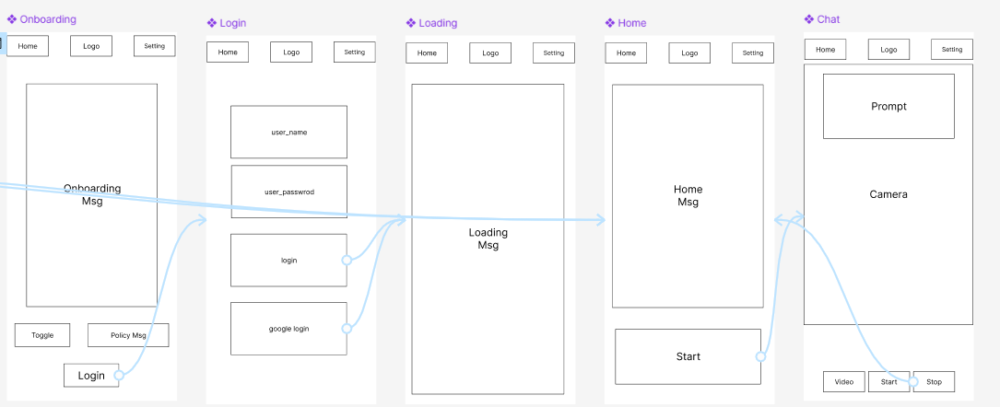

# Project Clove

## Market
Clove is a real-time AI agent that utilizes mobile camera technology to recognize the user's environment through photo and video modes. The project aims to synchronize with other wearable devices via Clove Glass, enhancing user interaction and information retrieval.

## Target Audience
The target audience consists of users who wish to obtain real-time information through large language models (LLMs).

## App Information
Clove is designed to provide personalized assistance by leveraging advanced AI capabilities. Users can interact with the app to receive tailored responses and insights based on their queries.

## App Structure
The app is structured to facilitate a seamless user experience, incorporating features that allow for easy navigation and interaction with the AI agent.

### Wireframe

## Prototyping

## Project Structure
The project is organized into several key components:
- **lib/**: Contains the main application code.
- **assets/**: Stores images, icons, and other resources.
- **models/**: Defines data structures and business logic.
- **screens/**: Contains different screens of the application.

## Demo
